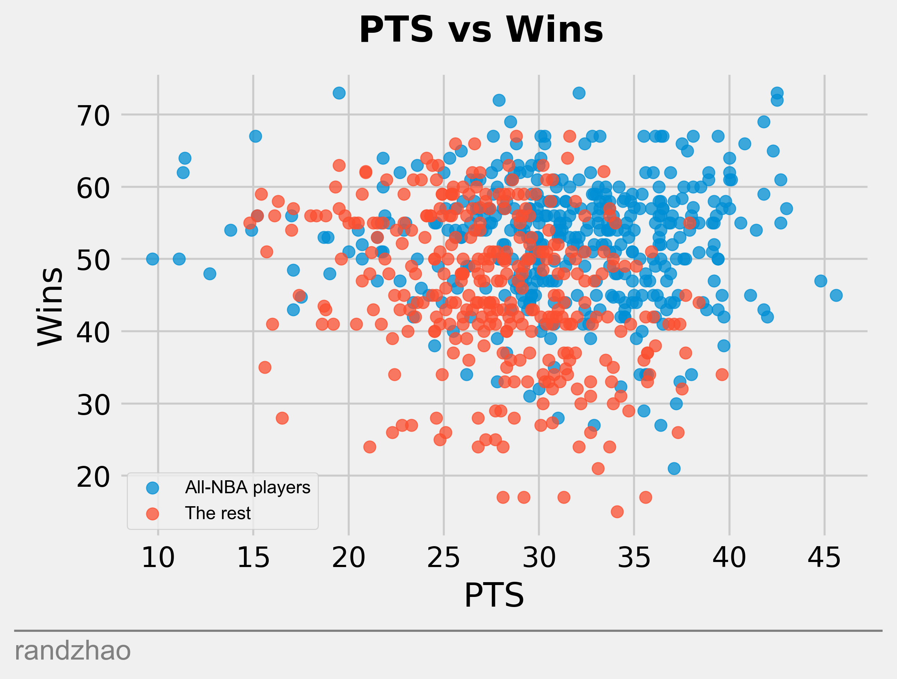
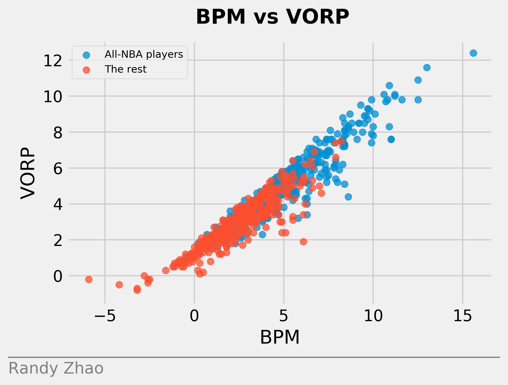
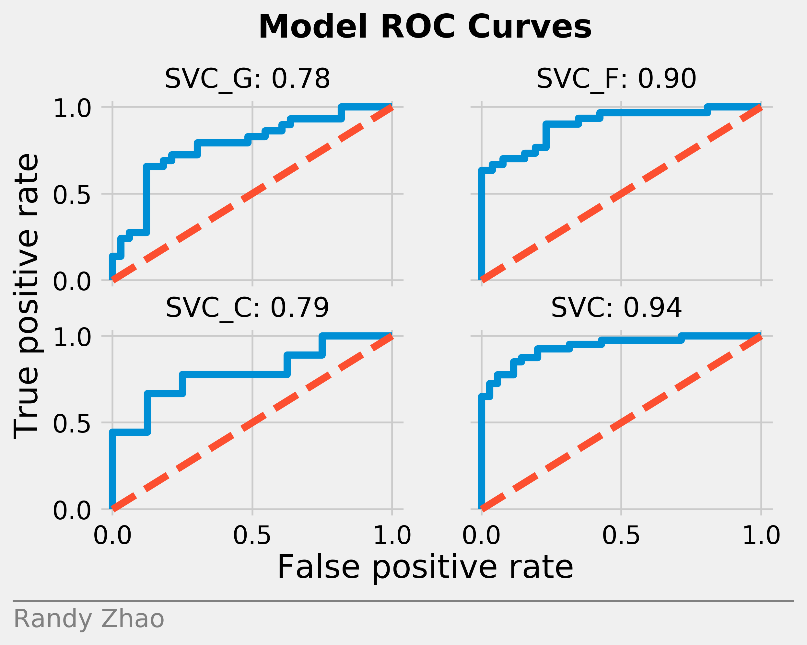
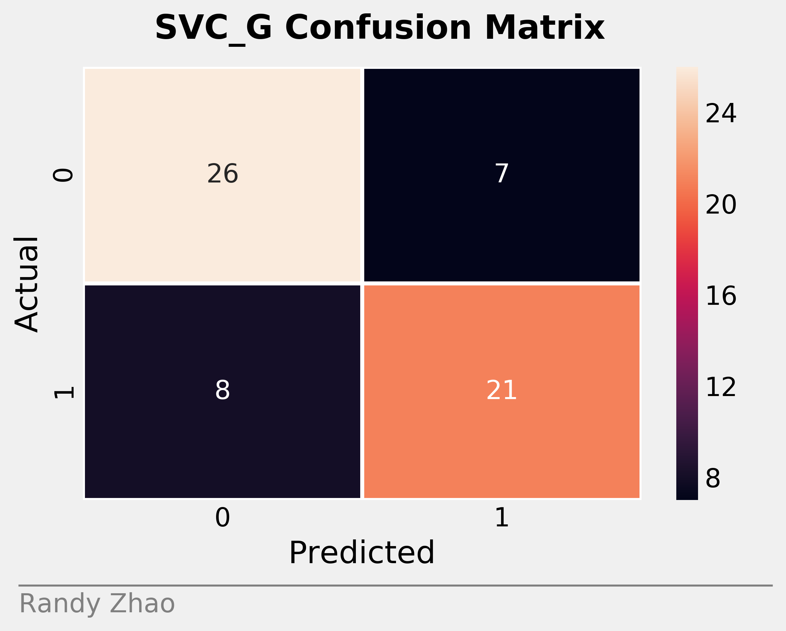
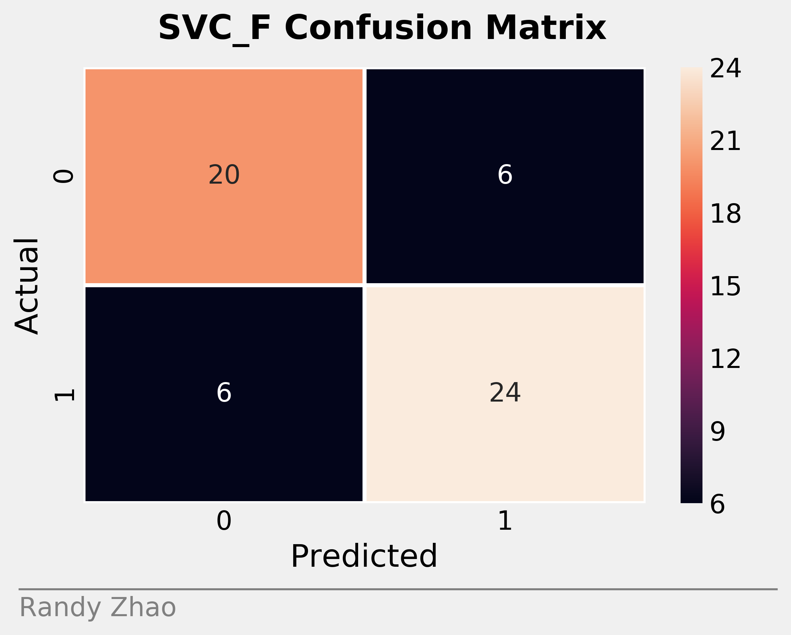
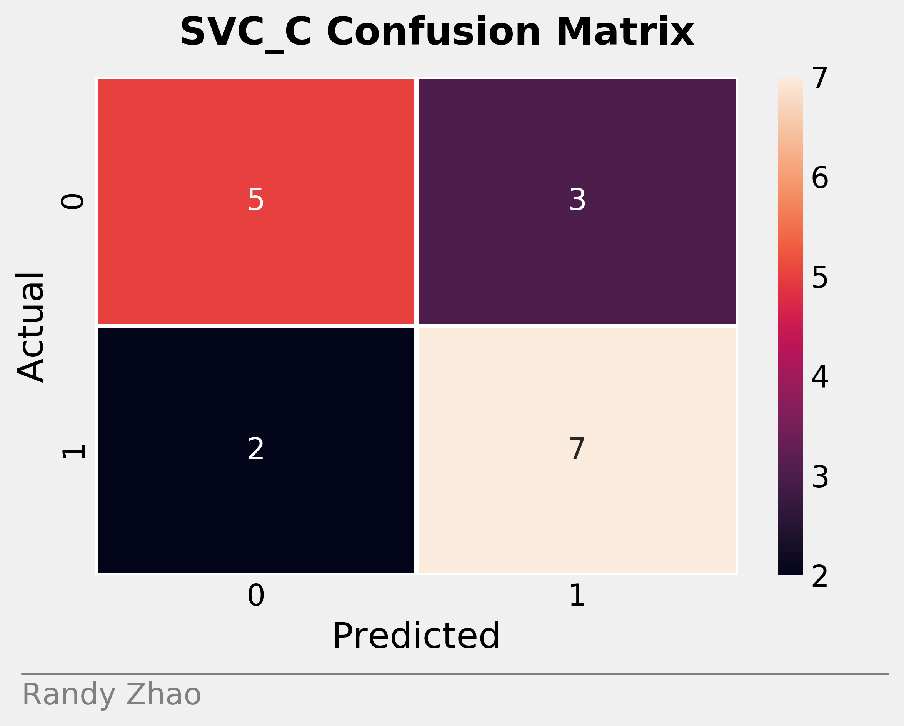
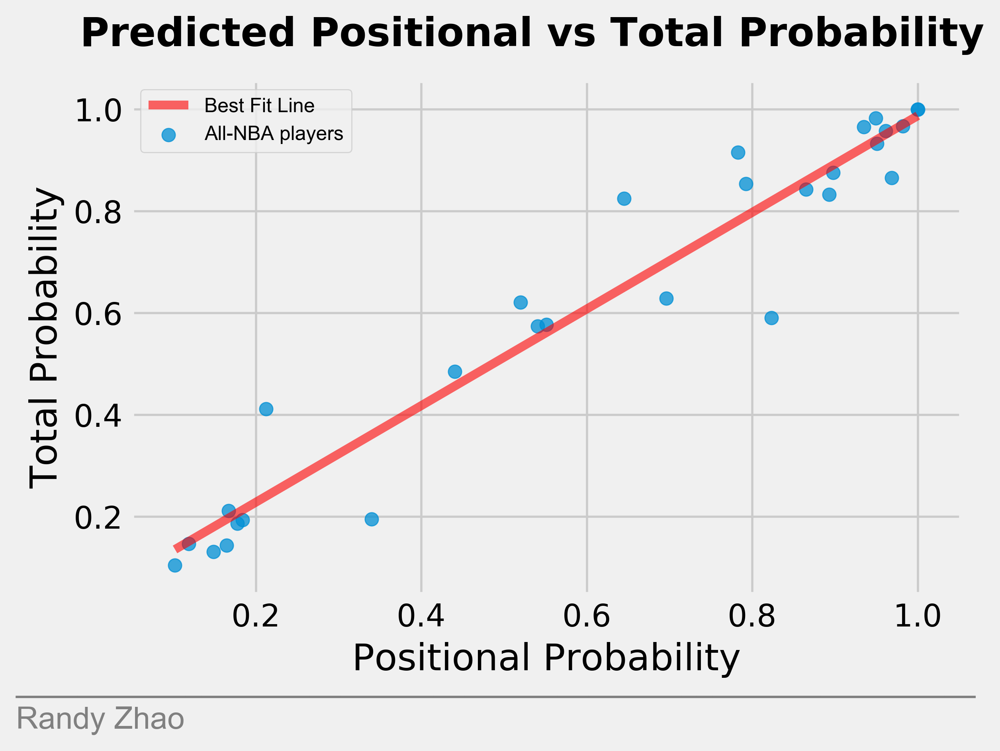

# All-NBA Predictor 
Inspired by dribble analytics blog post (https://dribbleanalytics.blog/2019/03/ml-all-nba-predict/), I hoped to create a similar project with slight modifications, specifically tweaks to the feature selection as well as the approach to classification. The main purpose of this exercise was to familiarize myself with web scraping, machine learning, and presenting my data. To do so, I created multiple classifiers (based on position and regardless of position) to help determine which of the top NBA players would be make an All-NBA team. Then, I used a k-means clustering to group the players based by the predicted probabilities to separate these elite NBA players into tiers.

# Methods
In order to predict which players would make the All-NBA team, let us first examine the structure of an All-NBA team. It consists of two Guards, two Forwards, and one Center. To approach this, we first recognize that this is a classification problem. This is because rather than predicting a number or a score of some sorts, we want to classify whether or not a player would be on an All-NBA team (either 1 or 0). We can use the predicted probability to divide these All-NBA players into the three levels of teams.

Thus, I created two types of classifiers: one that was trained on data for a specific position (i.e. data for players of a specific position), and one that was trained on the entire data set. 

# Data and Feature Selection
Since All-NBA players represent the top players across the league, and that most All-NBA players are All-Stars, the data set includes all the players that were either All-Stars or All-NBA players from the 1989-1990 season until the 2017-2018 season. In addition, as this is a classification problem, the stats (features) chosen become extremely important. Typical stats that casual fans recognize are PTS/G, TRB/G, AST/G, FG%, Team Wins. However, with the rise of advanced stats and analytics in basketball, I opted to utilize these measures over the traditional stats that often are misleading: PTS per 100 possessions, TRB per 100 possessions, AST per 100 possessions, TS%, WS/48, BPM, VORP, Team Wins, Overall Seed. These features offer an insightful blend of individual performance and value (WS/48, VORP), defensive value (BPM), as well as team success (Team Wins, Overall Seed). As for the counting stats, I chose per possession stats to represent them.

## A quick aside: Basketball philosophy
The reason I prefer to use per possession stats is because it adjusts for pace and normalizes these counting statistics more accurately than per game or per minute stats. We can quickly identify the issue with per game problems with this scenario: 

Let player A score 50 points in 50 minutes, and player B scores 49 points in 25 minutes, which would be more impressive and valuable? From a PTS/G standpoint, player A's performance would be better. But that's from a pure volume perspective. We could argue that player B's scoring rate was much higher than player A's, and thus, player B's performance was actually superior. Despite this exaggerated example, it's clear that analyzing PTS/G does not offer us a wholistic view of the game. 

The next logical step would be to break down player performance into units of time, but that also creates problems. Consider this scenario: a veteran player comes off the bench, and in garbage time, scores 4 points and records 1 rebound in 1 minute of play. That player's per 36 stats would look like this: 144 PTS and 36 RBS! In general, per 36 stats tend to overstate players who play less than 36 minutes, and as stars continue to rest for increased longevity and health, these stats can largely inflate modern day players, especially in comparison to previous generations.

So we have explored the faults of examing non-standardized stats, but now the standardized stats are also riddled with issues. This is where per possession stats arrive. In basketball, the most basic unit of the game is a possession. When one team who is on offense attempts to put the ball in the basket and score. The moment the ball falls into the possession of the defending team, either through a score, turnover, missed shot, etc., then we now have another possession. Tracking how many possessions a player plays and adjusting their stats based on this unit normalizes many aspects of the game, adjusting for pace and thus a more flexible statistic in analyzing different eras of basketball. 

We measure efficiency with TS% rather than the traditional FG% and the (relatively) newer eFG%, since TS%, simply put, is points per shots. It incorporates all facets of scoring, and is thus less arbitrary than FG%, which may ignore the style of player (3-D vs slasher vs volume shooter).

# Data Collection
The data was collected from Basketball Reference (for the All-NBA players, season wins, and seeds), and Wikipedia to find the All-Stars. I first gathered all the notable players, who were either an All-Star or All-NBA player once. Then, I wrote a custom scraper to gather player data for the relevant seasons, defined as being an All-Star, All-NBA, or both (for that season). There were 750 data points, and 55% of them were All-NBA players, signaling that our data set was relatively balanced. This balance is important for classification problems, since this could skew our model. The testing data consisted of all the NBA All-Stars, along with some notable snubs, such as Rudy Gobert.

# Understanding the Data
In order to ensure that there is a quantifiable difference between All-NBA and non All-NBA players, I plotted several statistics and separated the data set based on whether or not they were on an All-NBA team. Here are some of the results:

As we can see, this plot of points vs wins is pretty noisy, but it does seem to imply that individual scoring separates players moreso than team success. 

Similarly, we see that points seem to matter more than efficiency, but this plot is also fairly noisy.

This plot seems to be a little more insightful, as WS/48 also seem to separate the NBA players. 

We also start to see that VORP matters a little bit more than wins do. 

These graphs are all pretty noisy, and don't offer a clear picture of the difference. It seems that points and individual statistics matter more than efficiency or team success. Let's take a closer look.

The relationship here is more linear and shows a separation between All-NBA players and non All-NBA players, as the concentration of All-NBA players strengthens as we increase the BPM and VORP

This graph shows a similar trend of All-NBA players outpacing non All-NBA players in terms of these advanced statistics. 

Finally, we can investigate some histograms that also may help reveal differences.

We see that the All-NBA players' histograms are centered more to the right in all the cases, indicating a difference in performance between these types of players.

# Model Creation
With scikit-learn, I created two types of classifiers: a generic classifier that was trained on the entire data set, and another classifier that was trained on parts of the data set based on position. This was to account for the fact that different positions are traditionally tasked with different aspects of the game (guards with assists and centers with rebounds). So, players were predicted through a SVM classifier that considered their position, and also regardless of their position. SVM, or support vector machine, works by creating a hyper-plane in a p-dimensional feature space that tries to maximize the margin, or maximizing the distances between the hyperplane and the closest classes. A key component to optimizing non-linear SVM models is the kernel function. Since the guards and positionless classifier consisted of more varying data points (guards include point guards and shooting guards, whose functions are vastly different), I used a polynomial kernel function. For the forwards and centers, I used a Radial basis kernel function, or rbf.

# Model Analysis
For basic goodness of fit, I performed 10-fold cross-validation to gauge the performance of the models created, which splits the data set into 10 equal sets, and iteratively trains on 9 of the 10 sets, and tests on the remaining set. I then calculated various standard evaluative metrics, specifically accuracy, recall, precision, F1, cross-validation score, log loss, and area under the ROC curve. Accuracy gives us an idea of the percentage of correct predictions the model made, whereas recall and precision indicate the model's ability to predict the positive and negative class respectively. F1 combines these two measures and offers more insight into comparing models. The area under the receiver operating characteristic, or AUC-ROC, is another performance meaasurement that plots recall against (1 - specificity) at various thresholds. The AUC gives us the area under the ROC, essentially gives us the probaability that our model will classify an All-NBA player over a non All-NBA player. Log loss measures the performance of a classification model on a scale of 0 to 1, where 0 represents no log loss and thus a perfect model. Log loss can offer a deeper understanding into the models accuracy, since accuracy is simply the number of correct classifications, whereas log loss incorporates the entropy of the model's predictions. Cross-validation score is important to check for overfitting, which refers to a model becoming too familiar with the training data set, and thus impedes the model's ability to  predict future data. The scores for the model were: 

Scores for SVC_G
Accuracy score: 0.758
Recall: 0.724
Precision: 0.750
F1: 0.737
Area under ROC curve: 0.780
Log loss: 0.602
Accuracy (cross validation score): 0.694 (+/- 0.040)

Scores for SVC_F
Accuracy score: 0.786
Recall: 0.800
Precision: 0.800
F1: 0.800
Area under ROC curve: 0.901
Log loss: 0.395
Accuracy (cross validation score): 0.681 (+/- 0.251)

Scores for SVC_C
Accuracy score: 0.706
Recall: 0.778
Precision: 0.700
F1: 0.737
Area under ROC curve: 0.792
Log loss: 0.538
Accuracy (cross validation score): 0.467 (+/- 0.094)

Scores for SVC
Accuracy score: 0.840
Recall: 0.875
Precision: 0.833
F1: 0.854
Area under ROC curve: 0.936
Log loss: 0.341
Accuracy (cross validation score): 0.840 (+/- 0.062)

I also plotted confusion matrices for the given models, which help visualize the model's ability to accurately classify an All-NBA player as an All-NBA player and classify a non All-NBA player as not an All-NBA player. 

As we can see, all the models performed fairly well, with decent accuracy scores. The positional classifiers actually performed worse than the SVC, likely due to having less training data as a result of dividing up the data set.

Finally, to compare the positional SVM and the positionless SVM, I graphed the probabilities for players predicted by the positional SVM against the positionless SVM.

The relationship appears pretty linear, indicating that the models were fairly consistent with one another. 

# Results
Using both a position-based and positionless SVM classifier, I predicted the probability of an NBA player making an All-NBA team. To decide which team a player would be, I sorted these players based on the average of the two probabilities, and filled out the three All-NBA teams based on its structure of 2 guards, 2 forwards, and 1 center. The predicted results were:

Team  | C | F | F | G | G
------|---|---|---|---|---
First Team All-NBA  | Nikola Jokic (0.966) | Giannis Antetokounmpo (0.999) | Kevin Durant (0.942) | Steph Curry (0.975) | James Harden (0.999)
Second Team All-NBA | Joel Embiid (0.950) | Kawhi Leonard (0.917) | Paul George (0.887) | Damian Lillard (0.960) | Kyrie Irving (0.898)
Third Team All-NBA | Rudy Gobert (0.854) | LeBron James (0.707) | Blake Griffin (0.662) | Russell Westbrook (0.849) | Kemba Walker (0.571)

Since the All-NBA teams are already out, we can see that our predictions were almost exact! Aside from Paul George, who was named to All-NBA First Team, all other players were correctly predicted. The model actually predicted that Paul George should be lower than Kawhi Leonard as well. While Kawhi Leonard and Kevin Durant shined on stellar teams, Paul George seemed to be carrying the Thunder through a competitive Western Conference, but unfortunately got injured. The model fails to capture narratives, and as Kevin Durant and Kawhi Leonard have been playing at exceptional levels, Paul George's recent surge in production and value did not push him over these dominant forwards. 

Finally, I used K-Means clustering to group the players in the test set into four tiers based upon their predicted probabilities. I decided upon four clusters because it was more insightful than three clusters, but implenting more than five clusters began to create singletons. 

### Players in tier 1 included: 
Nikola Jokic, Giannis Antetokounmpo, Kevin Durant, Steph Curry, James Harden, Joel Embiid, Kawhi Leonard, Paul George, Damian Lillard, Russell Westbrook, Kyrie Irving, Rudy Gobert, Nikola Vucevic
### Players in tier 2 included: 
LeBron James, Blake Griffin, Karl-Anthony Towns
### Players in tier 3 included:  
D'Angelo Russell, Kemba Walker, Anthony Davis, LaMarcus Aldridge
### Players in tier 4 included: 
Ben Simmons, Jimmy Butler, Kyle Lowry, Victor Oladipo, Klay Thompson, Mike Conley, Bradley Beal, Jrue Holiday, Khris Middleton

Overall, the exercise helped me gain a greater understanding of data science, and it was very fun to explore basketball analytics. For the future, I can incorporate more models, along with more neatly organizing my code. 
